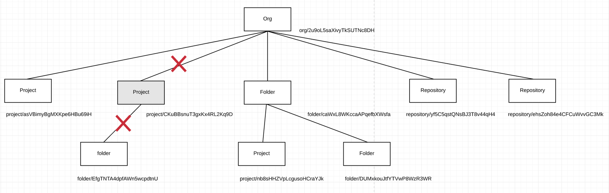
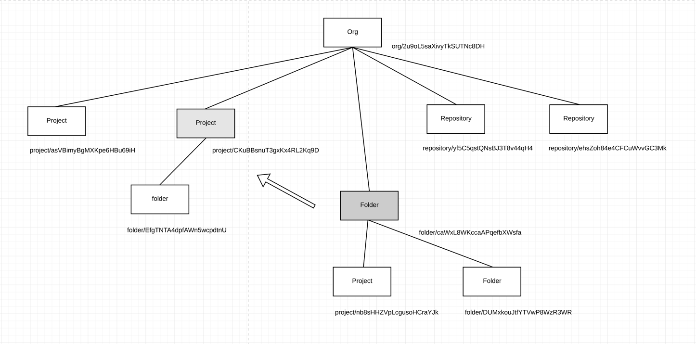

# User Stories

## Deleting things from the path.

Deleting data from a service is a big topic by its own. We want to use `user stories` and try to see what will happen if we try to delete things 
that have dependencies. 

## User stories
 

Let's assume the following structure

Assume the following structure, (and we don't take into account assets, templates, bit, dav, fields)

- Org: `Forth Valley College`
    - Folder: `Dataflow Unit 2021`
        - Folder: `Solutions`
        - Folder: `Markings`
            - Folder: `Alice GID 1392`
                - Project: `Spring Assignment 2021 GID 1392`
            - Folder: `Bob GID 2201`
                - Project: `Spring Assignment 2021 GID 1392`
        - Project: `Dataflow Forth Valley`
    - Project: `Public Unit 2021`
    - Repository: `Forth Valley Assets`
    - Repository: `Dataflow Unit Assets`
    
__How do we delete a resource that has content inside?__
    

_Figure 1. Sample hierarchy list_

The steps to remove a node from the hierarchy, and the subtree could be achieved by a single query

```sql
-- delete a vertex and the subtree
with target_root as (
    select path_uri as root_uri, (hierarchy -> path_uri ->> 'order')::int as path_order 
    from demo.base where path_uri = 'project/CKuBBsnuT3gxKx4RL2Kq9D' and not deleted
)
update demo.base set deleted = true  from target_root where not deleted and (hierarchy -> root_uri ->> 'type' = 'project') 
      and (hierarchy -> path_uri ->> 'order')::int >= target_root.path_order returning path_uri, type, label, created_at, owner;
```

_( for more information about the hierarchy field, see [hierarchy model](./README.md#postgres-model))_

__How do we move a resource that has content inside?__


The steps we need to follow to update the path is the following: 
1. Update the target node with the new parent node.
2. Update the target node hierarchy field.
    1. First update the hierarchy of the target node
    2. Follows the subtree update hierarchy.
    3. Finally, the order update for each node including target and subtree nodes.
3. 
    
